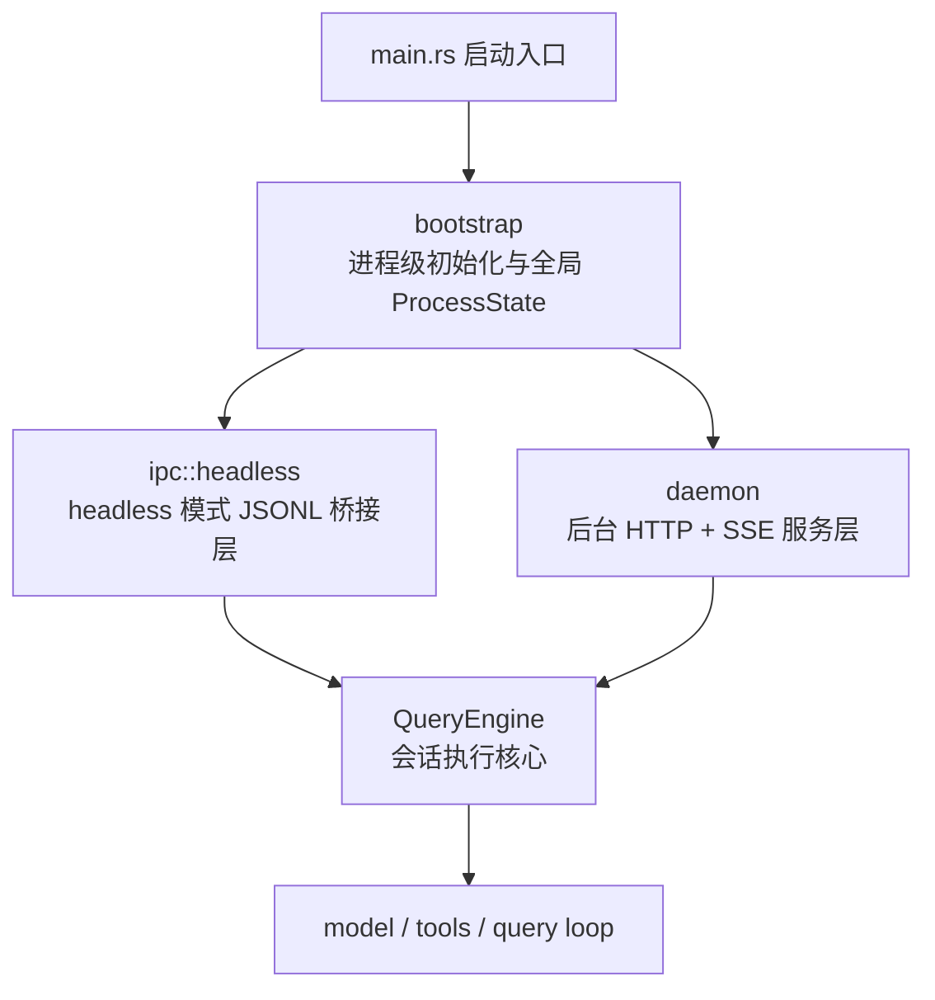
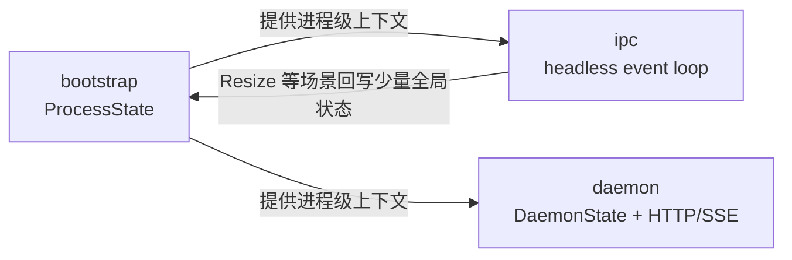

# bootstrap / ipc / daemon 结构与路径对照

本文说明 `src/bootstrap`、`src/ipc`、`src/daemon` 三个模块的职责边界、调用关系，以及同一条用户输入在 `headless` 与 `daemon` 两种模式下的执行路径。

## 1. 整体结构图



### 结构解释

- `bootstrap` 是底座，先初始化，再进入具体运行模式。
- `ipc` 和 `daemon` 都是 `QueryEngine` 的外层适配器，但服务的宿主不同。
- `ipc` 面向本地前端进程，靠 `stdin/stdout` 走 JSON Lines 协议。
- `daemon` 面向后台常驻服务，靠 HTTP API 和 SSE 对外提供能力。
- 真正执行对话、工具调用、流式输出的是 `QueryEngine::submit_message(...)`。

## 2. 启动分叉图

```mermaid
flowchart TD
    A[main()]
    B[创建 QueryEngine]
    C[bootstrap::init_process_state(...)]
    D{运行模式}
    E[--daemon]
    F[DaemonState::new(...)]
    G[serve_http(...) + tick_loop(...)]
    H[--headless]
    I[ipc::headless::run_headless(...)]
    J[普通 TUI/UI 路径]

    A --> B --> C --> D
    D --> E --> F --> G
    D --> H --> I
    D --> J
```

### 关键入口

- `bootstrap` 初始化：`src/main.rs` 中先调用 `bootstrap::init_process_state(...)`
- `daemon` 分支：`cli.daemon`
- `headless` 分支：`cli.headless`

## 3. 三个模块各自负责什么

### `src/bootstrap`

负责“进程级全局状态”，例如：

- `original_cwd`
- `project_root`
- `session_id`
- `initial_main_loop_model`
- `total_cost_usd`
- 终端尺寸

特点：

- 生命周期覆盖整个进程
- 通过全局 `PROCESS_STATE` 访问
- 尽量不依赖上层业务模块

它回答的问题是：

“这个进程是谁、从哪里启动、当前全局统计是什么。”

### `src/ipc`

负责 `--headless` 模式下 Rust 后端与外部 UI 的桥接。

它处理：

- 前端发来的 `SubmitPrompt`
- `AbortQuery`
- `PermissionResponse`
- `SlashCommand`
- `Resize`
- LSP / MCP / Plugin / Skill 子系统命令

它回答的问题是：

“如何把一个外部 UI 进程接到 QueryEngine 上，并保持交互式会话体验。”

### `src/daemon`

负责 `--daemon` 模式下的后台服务壳。

它处理：

- `POST /api/submit`
- `POST /api/abort`
- `GET /api/status`
- `GET /events` SSE
- 主动 `tick_loop`
- 通知、事件缓冲、客户端重连补发

它回答的问题是：

“如何把 QueryEngine 包装成一个可常驻、可远程接入、可主动运行的后台服务。”

## 4. 关系图：bootstrap 与另外两者



### 这里要注意

- `bootstrap` 不是 `ipc` 或 `daemon` 的上位业务编排器。
- 它更像所有模式共享的运行时底座。
- `ipc` 和 `daemon` 各自有自己的状态容器：
  - `ipc` 主要围绕 event loop、pending permission、pending question
  - `daemon` 主要围绕 `DaemonState`、SSE clients、event buffer、notification channel

## 5. 同一条用户输入的对照图

下面对照同一条“用户发来一条 prompt”在两种模式下的执行路径。

```mermaid
flowchart TB
    subgraph Headless["headless 模式"]
        H1[外部前端]
        H2[stdin JSONL<br/>FrontendMessage::SubmitPrompt]
        H3[ipc::headless::run_headless]
        H4[engine.reset_abort()]
        H5[engine.submit_message(...)]
        H6[SdkMessage 流]
        H7[BackendMessage]
        H8[stdout JSONL 回前端]

        H1 --> H2 --> H3 --> H4 --> H5 --> H6 --> H7 --> H8 --> H1
    end

    subgraph Daemon["daemon 模式"]
        D1[客户端 / Web UI]
        D2[POST /api/submit]
        D3[daemon::routes::submit]
        D4[state.engine.wake_up()]
        D5[state.engine.submit_message(...)]
        D6[SdkMessage 流]
        D7[sdk_message_to_sse(...)]
        D8[state.broadcast(...)]
        D9[GET /events SSE]

        D1 --> D2 --> D3 --> D4 --> D5 --> D6 --> D7 --> D8 --> D9 --> D1
    end
```

## 6. 两条路径的关键不同

### 传输协议不同

- `ipc`：`stdin/stdout` + JSON Lines
- `daemon`：HTTP + SSE

### 会话宿主不同

- `ipc`：一个外部前端进程直接驱动当前 Rust 进程
- `daemon`：一个后台服务接收多个客户端请求与订阅

### 交互能力侧重点不同

- `ipc` 更偏强交互：
  - permission callback
  - ask-user callback
  - slash command
  - terminal resize
- `daemon` 更偏服务化：
  - SSE 广播
  - event replay
  - attach/detach
  - proactive tick

### 主动执行能力不同

- `ipc` 主要是“前端驱动一次请求”
- `daemon` 除了接收请求，还能定时自主触发 `tick_loop`

## 7. 简化结论

```text
bootstrap = 进程级底座
ipc       = headless 模式下的本地前后端桥
daemon    = daemon 模式下的后台服务壳
```

如果只看依赖方向，可以记成：

```text
main
  -> bootstrap
  -> (ipc | daemon)
  -> QueryEngine
  -> model/tools/query
```

如果只看“谁负责执行模型”，答案始终是：

```text
核心执行者是 QueryEngine，不是 bootstrap / ipc / daemon
```
